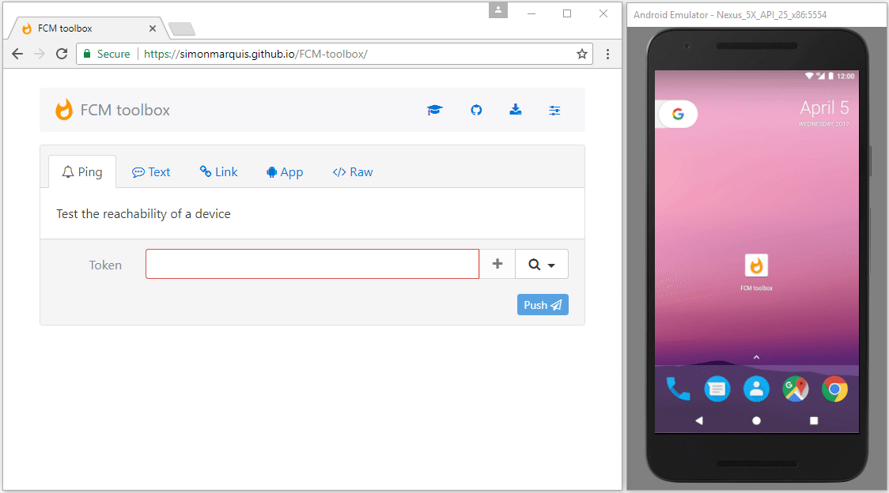
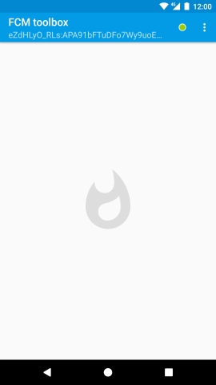
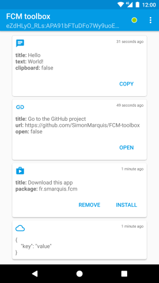
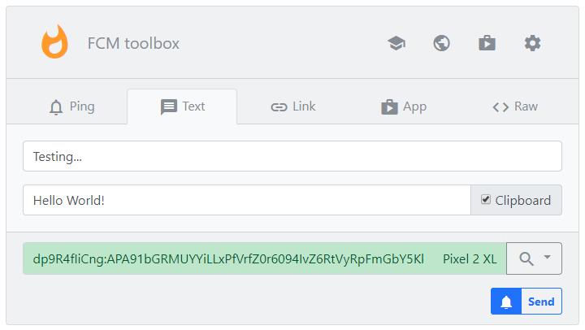
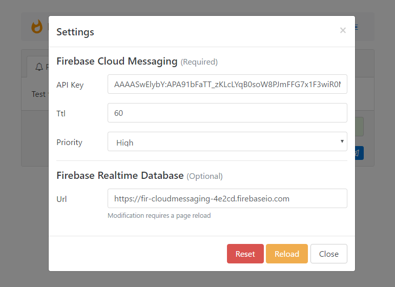

# FCM toolbox

This public toolbox allows you to easily **test** and **debug** the [Firebase Cloud Messaging](https://firebase.google.com/docs/cloud-messaging/) service.
- Send and receive FCM messages
- Manage registered devices
- Self-hosting capabilities

**On the public toolbox versions, users share the same [FCM](https://firebase.google.com/docs/cloud-messaging/) and [FRD](https://firebase.google.com/docs/database/) instances, be responsible!**

## Android app

Download the latest public version on the [Play Store](https://play.google.com/store/apps/details?id=fr.smarquis.fcm) or choose your [release version](https://github.com/SimonMarquis/FCM-toolbox/releases).

- Notify its presence and send its FCM token to a remote server
- Issue a notification for each message
- Retain all received messages

NOTE:
If you have an issue with the token not showing in the app, it's possibly because of the DNS on your device (virtual or physical). 

- If you use a virtual device, [set the DNS](https://developer.android.com/studio/run/emulator-networking#dns).

or just simply use your physical device. and make sure you use the right DNS.

  

### Configuration

You can build your own version of the Android FCM toolbox app and provide your own `google-services.json` file.  
[See official documentation](https://firebase.google.com/docs/cloud-messaging/android/client).

## Web app

The public web app is located at [https://fcm-toolbox-public.web.app](https://fcm-toolbox-public.web.app)

- Send multiple types of payloads
- Maintain a local list of devices
- See online devices

### Configuration

You can host your own version of the web FCM toolbox or simply provide your own Firebase identifiers.  
[See official documentation](https://firebase.google.com/docs/cloud-messaging/js/client).  

 
